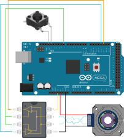

# AMT24 Arduino RS-485 Sample Code

## Table of Contents

- [Hardware](#hardware)
- [Software Required](#software)
- [AMT24 Encoders](#amt24-encoders)
- [Setup](#setup)
- [Circuit](#circuit)
- [AMT24 Commands](#amt24-commands)
- [Code Tutorial](#code-tutorial)
  - [Includes and Defines](#includes-and-defines)
  - [Initialization](#initialization)
  - [RS-485 Communication](#rs-485-communication)
  - [Checksum Verification](#checksum-verification)
  - [Data Formatting](#data-formatting)
  - [Set Zero Position](#set-zero-position-single-turn-only)
  - [Read Turns Counter](#read-turns-counter-multi-turn-only)
  - [Running the Code](#running-the-code)
  - [Multiple Encoders](#multiple-encoders)

## Hardware

- [Arduino Mega](https://docs.arduino.cc/hardware/mega-2560)
- [Sparkfun RS-485 Transceiver](https://www.sparkfun.com/products/10124), many alternative options are available
- [AMT24 encoder](https://www.cuidevices.com/product/motion-and-control/rotary-encoders/absolute/modular/amt24-series)
- [AMT-????-036 cable](https://www.cuidevices.com/product/motion-and-control/rotary-encoders/encoder-accessories/amt-cables/amt-06c-1-036), or similar cable with proper connector

## Software

- [Arduino IDE](https://www.arduino.cc/en/Main/Software)
- [AMT24 Arduino Sample Code](https://github.com/cuidevices/AMT24_RS485_Sample_Code_Mega)
- [AMT Viewpoint](https://www.cuidevices.com/amt-viewpoint) *optional, for updating firmware*

## AMT24 Encoders

The AMT24 is an absolute encoder available with either 12-bit or 14-bit resolution. This means that over a single revolution, the encoder will have that many distinct positions. For a 12-bit encoder there are 4096 distinct positions, and for a 14-bit encoder there are 16384 positions. No matter how many times the device is rotated, the encoder will always know its absolute position. Knowing the absolute position means that you will always know the exact angle of the device.

The AMT24 comes in both single-turn and multi-turn variants. The single-turn variants keep track of the position within a single rotation (i.e.: 0-360°). The multi-turn variants also count the number of complete rotations that the encoder has passed through. The single-turn variants also have a programmable zero point, allowing you to define where the encoder should have its origin.

The AMT24 operates at a 2Mbps baud rate.

## Setup

You may want to ensure that the AMT24 encoder has the latest firmware. You can use the programming module for the AMT24 and our AMT Viewpoint software to verify the encoder firmware is up-to-date.

## Circuit

The following connections are for the [Arduino Mega board](https://docs.arduino.cc/hardware/mega-2560), however, most all Arduino boards will be compatible with this code. The connections to various Arduino boards will be different than this example, so consult Arduino documentation for additional information.



Notes:
- Some RS-485 transceivers run on a 3.3V supply, some run on a 5V supply. Some can run on either.
- The R̅E̅ (receiver enable, negative) and DE (driver enable) signals can be tied together. This makes it easy to simultaneously disable the receiver and enable the driver, or vice-versa.
- For this test, with short cable lengths, we will not use RS-485 termination resistors. If longer cables are used to connect the encoder to the RS-485 transceiver, then termination resistors should be installed at both ends of the cable, especially at higher baud rates. The resistors should be chosen to match the characteristic impedance of the cable used.
- We use a small push-button to trigger the zero command. Pushing this button will set the current position of the encoder to zero.

### Encoder Connections

| Encoder Function | Encoder Pin Number | AMT-06C-1-036 Color |
| ---------------- | ------------------ | ------------------- |
| Unused | 1 | TBD |
| Unused | 2 | TBD |
| B | 3 | TBD |
| A | 4 | TBD |
| Unused | 5 | TBD |
| Unused | 6 | TBD |
| GND | 7 | TBD |
| +5V | 8 | TBD |

### Transceiver Connections

| Transceiver Function | Arduino Mega Pin |
| -------------------- | ---------------- |
| VCC | +3.3V |
| RO | 19 (RX1) |
| DI | 18 (TX1) |
| R̅E̅/DE | 23 |

## AMT24 Commands

The AMT24 begins transmitting the absolute position immediately when SPI begins transferring data, preventing the need for a command and response structure. Therefore, the host will send 0x00 as the first byte, with valid data being returned at the same time. As a result, if the host wants to send a zero command, it will go on the second transmitted byte. We call this an extended command. For more information, please reference the [AMT24 datasheet](https://www.cuidevices.com/product/resource/amt24.pdf).

| Command | Byte | Notes |
| ------- | ---- | ----- |
| Get Position | 0x00 |  |
| Get Turns | 0x01 | Multi-turn only |
| Set Zero Position | 0x02 | Single-Turn only |
| Reset Encoder | 0x02 |  |

## Code Tutorial

### Includes and Defines

We will use two of the Arduino's serial interfaces: one for communication with the encoder over RS485, and the other for communication with the PC over USB.

The RS485 communication with the encoder will use a baud rate of 2 Mbps. To get the position from the Arduino to the computer, we will use the built-in USB-serial connection to the Arduino IDE, with a baud rate of 115200. We should also define the commands used by the AMT24. Because the encoder does not care about the content of the first byte, we will define it as a NOP (no-operation).

We also want to use defines at the top for the SPI pins. This way, if the code needs to be modified for a different board or we want to change which pins we use, it can easily be done here in one place. It is not necessary to define the main pins for SPI communication, but it is helpful to do as a reference.

```c
/* Serial rates for UART */
#define BAUDRATE         115200
#define RS485_BAUDRATE   2000000

/* RS-485 commands */
#define RS485_POS             0x00
#define RS485_TURNS           0x01
#define RS485_ZERO            0x02
#define RS485_RESET           0x03
```

### Initialization

In the `setup()` function, we will initialize all of our RS485 pins and set up our PC serial interfaces.

We also need to initialize the two serial ports. We use `Serial` for PC communication and `Serial1` for RS485 encoder communication.

```c
void setup()
{
  //Set the modes for the RS485 transceiver
  pinMode(RS485_T_RE, OUTPUT);
  pinMode(RS485_T_DE, OUTPUT);
  pinMode(RS485_T_RO, INPUT_PULLUP); //enable pull-up on RX pin so that it is not left floating when the transceiver is in transmit-mode

  pinMode(ZERO_BUTTON, INPUT_PULLUP); //enable pull-up resistor so that we can detect when the button is pressed, which connects to GND

  //Initialize the UART serial connection to the PC
  Serial.begin(USB_BAUDRATE);

  //Initialize the UART link to the RS485 transceiver
  Serial1.begin(RS485_BAUDRATE);
}
```

### RS-485 Communication

RS-485 data is transmitted by first enabling the driver of the RS-485 transceiver, then sending the data over `Serial1`, then disabling the transceiver driver.

The AMT24 will respond with the requested data.

It does not matter if the encoder has a resolution of 12-bits or 14-bits, it will always respond with two full bytes totaling 16 bits. The upper two bits are check-bits that allow us to confirm the data’s integrity. If the encoder is a 12-bit version, the bottom two bits will both be 0. For this data to be useful it must be shifted right 2 bits (or divided by 4).

We want to call the  `Serial1.write()` function, sending the `AMT24_POS` command to the specified address. We will then wait until `Serial1` finishes transmitting the command, then put the RS-485 transceiver back into receive mode.

```c
void sendCommandRS485(uint8_t command)
{
  /*
  * This sets the state of the RS485 transceiver.  To be fast, we are not using the digitalWrite functions but instead will
  * access the avr io directly. I have shown the direct access method and left commented the equivalent digitalWrite method.
  */
  PORTH |= 0b01100000; //put the transciver into transmit mode
  //digitalWrite(RS485_RE, HIGH); //ph5
  //digitalWrite(RS485_DE, HIGH); //ph6
  delayMicroseconds(10); //IO operations take time, let's throw in an arbitrary 10 microsecond delay to make sure the transeiver is ready
  Serial1.write(command); //transmit the command byte

  //Here we will make sure the data has been transmitted and then toggle the pins for the transceiver
  //Here we are accessing the avr library to make sure this happens very fast. We could use Serial.flush() which waits for the output to complete
  //but it takes about 2 microseconds, which gets pretty close to our 3 microsecond window. Instead we want to wait until the serial transmit flag USCR1A completes.
  while (!(UCSR1A & _BV(TXC1))); //wait for transmit to finish

  PORTH &= 0b10011111; //set the transceiver back into receive mode for the encoder response
  //digitalWrite(RS485_RE, LOW);
  //digitalWrite(RS485_DE, LOW);
}
```

### Checksum Verification

Now that we have completed the RS-485 transfer, we need to validate the data using the checksum.

Using the equation from the datasheet, we can create a function to verify that the received value has a valid checksum. The checksum is stored in the upper two bits of the received value. The check-bits are odd parity over the odd and even bits in the position response. So, we will check for parity against all the odd bits (bit 1, 3, 5, 7, 9, 11, 13) and parity against even (0, 2, 4, 6, 8, 10, 12, 14).

This function will return `true` if the checksum is valid.

```c
/*
 * Using the equation on the datasheet we can calculate the checksums and then make sure they match what the encoder sent.
 */
bool verifyChecksumRS485(uint16_t message)
{
  //checksum is invert of XOR of bits, so start with 0b11, so things end up inverted
  uint16_t checksum = 0x3;
  for(int i = 0; i < 14; i += 2)
  {
    checksum ^= (message >> i) & 0x3;
  }
  return checksum == (message >> 14);
}
```

### Data Formatting

If the check-bits are correct, then we want to update the `currentPosition` variable, stripping out the upper two bits. We AND our `currentPosition` variable with 0x3FFF (0b0011111111111111) to make sure we retain all 14 lower bits.

We also need to check the handle whether the encoder resolution is 12-bit or 14-bit. If the resolution is 12-bits, then simply shift `currentPosition` 2 bits to the right.

```c
if (verifyChecksumSPI(encoderPosition)) //position was good
{
  encoderPosition &= 0x3FFF; //discard upper two checksum bits
  if (RESOLUTION == 12) encoderPosition = encoderPosition >> 2; //on a 12-bit encoder, the lower two bits will always be zero

  Serial.print(encoderPosition, DEC); //print the position in decimal format
  Serial.write('\n');
}
else //position is bad, let the user know how many times we tried
{
  Serial.print("Encoder position error.\n");
}
```

### Set Zero Position (single-turn only)

Some AMT24 variants support a programmable zero position. This is an extended command, so we must start by sending the AMT24 the proper command. Then we can send the extended command (0x5E). Once the command is received the encoder will complete a reset. To make sure we are not talking to the encoder during this power on time we will implement a delay of 250 ms to be safe.

We can have our code set the zero position of the encoder first if we want, however, in normal applications you would only set the zero position once when configuring the device for use in the system.

```c
if(digitalRead(ZERO_BUTTON) == LOW)
{
  Serial.println("Zeroing...");
  sendCommandRS485(address | RS485_ZERO);
  delay(100); //wait for zero

  Serial.println("Zero done. Resetting...");
  sendCommandRS485(address | RS485_RESET);
  delay(500); //wait for reset to complete

  //wait for the button to be released
  while(digitalRead(ZERO_BUTTON) == LOW)
  {
    delay(100);
  }
}
```

### Read Turns Counter (multi-turn only)

Some AMT24 variants support a multi-turn counter.

If the position is bad, let the user know there was an error. If the position is good, simply report the position in the decimal format.

### Running the Code

Now that our code has been created, we can load it onto the Arduino and get talking to an encoder. Open the serial monitor, make sure the data rate is set to 115200, and see the encoder work.

### Multiple Encoders

One benefit of an RS-485 device is that you can talk to multiple encoders on the same bus. To do this we will need to set the encoders to have different addresses using AMT Viewpoint.

In the example code, we use an array of RS485 addresses, to allow any arbitrary number of encoders to be used.

```c
uint8_t addresses[1] = {0x54}; //only one encoder connected, using default address of 0x54
//uint8_t addresses[2] = {RS485_ENC0, RS485_ENC1}; //two encoders connected, 0x54 and 0x58 for addresses
```

We then loop over each CS pin and read the position from each connected encoder.

After data is transferred there is a minimum time before the chip select line can be released. This is specified in the datasheet as 3 microseconds. For slower data rates this is observed naturally, but we will implement it anyways.
